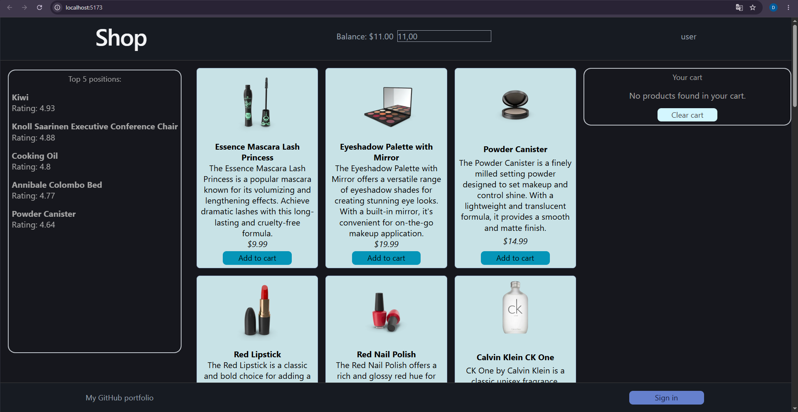
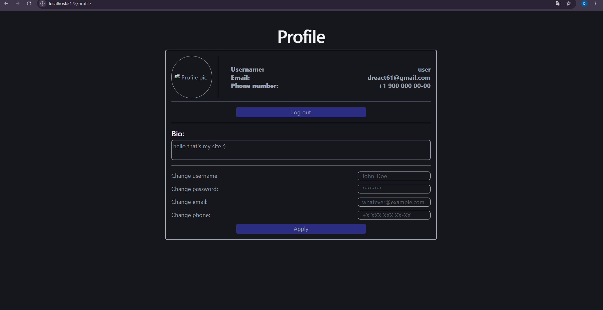
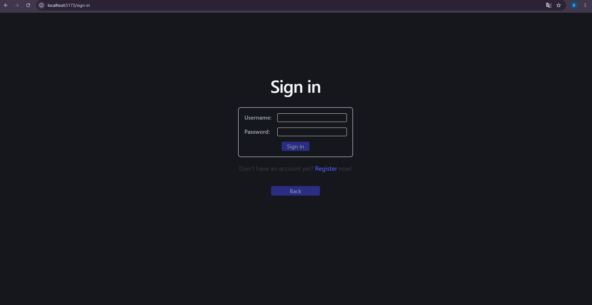

# React Store — интернет‑магазин

Мини‑магазин на React + TypeScript с корзиной, возможностью авторизации и адаптацией под размер экрана устройства.  
Данные тянутся с [https://dummyjson.com/products](https://dummyjson.com/products) через Axios.  
Баланс внутри проекта - не настоящий, его можно настраивать на странице профиля для тестов.

## Скриншоты





## Технологии

- React + TypeScript  
- Zustand - управление состоянием корзины и UI  
- Axios - работа с API DummyJSON (`https://dummyjson.com/products`)  
- Tailwind CSS - стили и компоненты  
- React Router (v6) - навигация по страницам  
- Vite - сборка проекта  

## Как запустить

1. Клонировать репозиторий:
   ```bash
   git clone https://github.com/Dreact61/react-shop-proj.git
   cd react-shop-proj
   ```

2. Установить зависимости:
   ```bash
   npm install
   # или yarn install
   ```

3. Запустить в режиме разработки:
   ```bash
   npm run dev
   ```

4. Открыть в браузере:
   - http://localhost:3000

## Основные функции

- Список продуктов с карточками.  
- Механика входа и выхода из аккаунта через `localStorage`.  
- Корзина (добавление, удаление, изменение количества) через Zustand.  
- Простая навигация (Главная, Профиль, Регистрация) через React Router.  

## Ссылка на демо

- Demo временно недоступно (проект доступен только локально).

## Потенциальное развитие

- Оформление заказа.  
- Страница с деталями продукта.  
- Регистрация и входы аккаунтов через backend‑технологии (например, Node.js + JWT).  

## Как внести вклад

Если хочешь улучшить проект:

1. Форкните репозиторий.  
2. Создайте свою ветку:
   ```bash
   git checkout -b feat/имя-фичи
   ```
3. Сделайте коммиты и создайте pull request.
